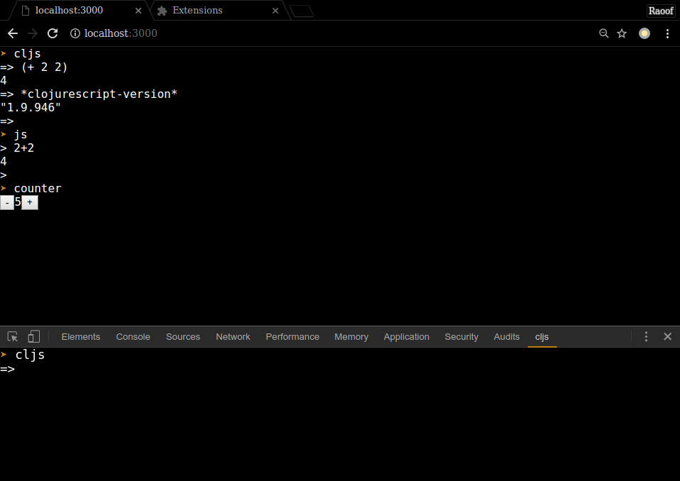

# cloter
in browser terminal with cljs and js repl. see demo [here](http://cljs.ir/cloter)

## Features
* simple cljs and js repl
* basic vi binding
* copy/paste from clipboard by selection and Ctrl-V / Shift-Insert
* custom app with gui inside terminal
